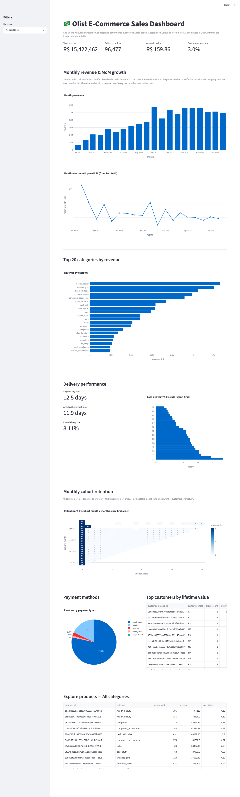

# 🛒 Olist Brazilian E-Commerce Sales Dashboard

An end-to-end Data Analytics project built using the **Olist Brazilian E-Commerce** dataset. This project demonstrates real-world data analysis by integrating multiple datasets, performing SQL-based analysis, and visualizing business insights through an interactive Streamlit dashboard.

---

## 📌 Project Overview

The goal of this project is to analyze sales performance, customer behavior, product categories, and logistics operations of a Brazilian e-commerce marketplace. Using data from approximately **100,000 orders** across multiple related tables, the dashboard provides actionable insights to support business decision-making.

---

## 🎯 Business Objectives

- Track overall sales performance and revenue.
- Monitor Average Order Value (AOV).
- Analyze monthly revenue trends.
- Identify top-performing product categories.
- Measure customer retention and repeat purchases.
- Evaluate delivery performance across different regions.
- Build an interactive dashboard for business stakeholders.

---

## 📂 Dataset

**Source:** Kaggle – Olist Brazilian E-Commerce Dataset

The project uses **9 relational datasets**, including:

- Orders
- Customers
- Order Items
- Order Payments
- Order Reviews
- Products
- Sellers
- Geolocation
- Product Category Translation

These datasets are connected using common keys such as `order_id`, `customer_id`, and `product_id`.

---

## 🛠️ Tech Stack

- Python
- SQL
- DuckDB
- Streamlit
- Plotly
- Pandas
- Matplotlib
- Seaborn
- Jupyter Notebook

---

## 📊 Dashboard Features

- 📈 Total Revenue
- 📦 Total Orders
- 💰 Average Order Value (AOV)
- 📅 Monthly Sales Trend
- 📊 Month-over-Month Growth
- 🛍️ Top Product Categories
- 🚚 Delivery Performance Analysis
- ⭐ Customer Review Insights
- 👥 Customer Retention Analysis
- 🌎 Regional Sales Performance

---

## 📷 Dashboard Preview

<p align="center">
  
</p>

---

## 📈 Key Insights

- Revenue exceeded **R$15 Million** across approximately **96K delivered orders**.
- Average Order Value (AOV) is around **R$160**.
- **Health & Beauty**, **Watches & Gifts**, and **Bed & Bath** are the highest revenue-generating categories.
- Average delivery time is approximately **12.5 days**.
- Late deliveries account for nearly **8%** of total orders.
- Customer retention is relatively low, indicating that business growth is primarily driven by acquiring new customers.

---

## 📁 Project Structure

```text
Olist-Ecommerce-Dashboard/
│
├── screenshots/
│   └── dashboard.png
│
├── analysis.ipynb
├── app.py
├── db.py
├── download_data.py
├── load_to_duckdb.py
├── queries.sql
├── README.md
```

---

## 🚀 How to Run

### Clone the repository

```bash
git clone https://github.com/SatishkumarYegireddi/Olist-Ecommerce-Dashboard.git
```

### Navigate to the project

```bash
cd Olist-Ecommerce-Dashboard
```

### Install dependencies

```bash
pip install -r requirements.txt
```

### Download the dataset

```bash
python download_data.py
```

### Load the data into DuckDB

```bash
python load_to_duckdb.py
```

### Launch the Streamlit Dashboard

```bash
streamlit run app.py
```

---

## 💡 Skills Demonstrated

- Data Cleaning & Transformation
- SQL Querying
- Multi-table Joins
- Exploratory Data Analysis (EDA)
- KPI Development
- Data Visualization
- Dashboard Design
- Business Intelligence
- Customer Retention Analysis
- Data Storytelling

---

## 🔮 Future Enhancements

- Sales Forecasting
- Customer Lifetime Value (CLV) Analysis
- Interactive Filters
- Predictive Analytics
- Real-time Data Integration

---

## 👩‍💻 Author

**Yegireddi Satish Kumar**

Aspiring Data Analyst passionate about turning raw data into meaningful business insights.

- GitHub: https://github.com/SatishkumarYegireddi
- LinkedIn: https://www.linkedin.com/in/satish-kumar-yegireddi-356685287/

---
